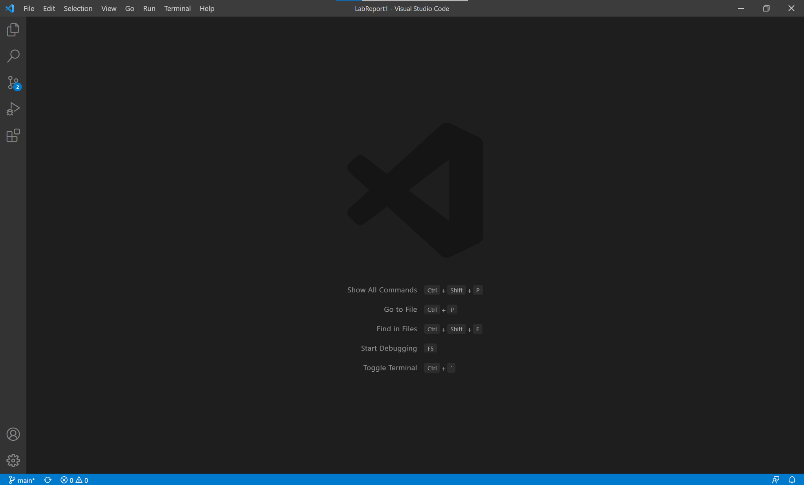

# How to Connect to the ieng Server in VS Code

## Installing VS Code

**VS Code** is a popular text editor by Microsoft that people use to write code. To use it, go to their [website](https://code.visualstudio.com/),  download the latest version, and open the app. It should look like this if you've never used it before.

Now, go to ==Terminal $\rightarrow$ New Terminal==. You will usually do this after opening VS Code.

## Remotely Connecting

To connect to servers, you can use SSH, which stands for secure shell. First, follow [this tutorial](https://docs.microsoft.com/en-us/windows-server/administration/openssh/openssh_install_firstuse) to download OpenSSH. Now, you need to get your account username for CSE 15L from [here](https://sdacs.ucsd.edu/~icc/index.php). You might have usernames for other classes, so find the one that starts with **`cs15Lwi22`**, and memorize the last three letters.

## Trying Some Commands

## Moving Files with `scp`

## Setting an SSH Key

## Optimizing Remote Running

