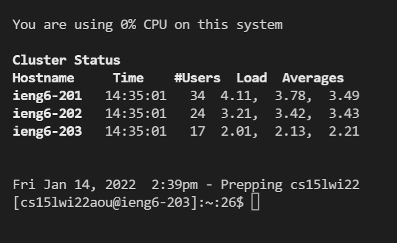
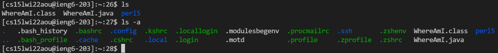
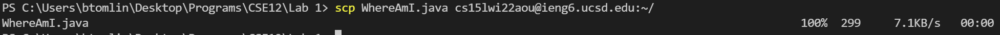

# How to Connect to the ieng Server in VS Code

## Installing VS Code

**VS Code** is a popular text editor by Microsoft that people use to write code. To use it, go to their [website](https://code.visualstudio.com/),  download the latest version, and open the app. It should look like this if you've never used it before.

Now, go to Terminal -> New Terminal. You will usually do this after opening VS Code.

## Remotely Connecting

To connect to servers, you can use SSH, which stands for secure shell. First, follow [this tutorial](https://docs.microsoft.com/en-us/windows-server/administration/openssh/openssh_install_firstuse) to download OpenSSH. Now, you need to get your account username for CSE 15L from [here](https://sdacs.ucsd.edu/~icc/index.php). You might have usernames for other classes, so find the one that starts with **`cs15lwi22`**, and memorize the last three letters.

Now, you're ready to connect to our server. In your VS Code terminal, type `ssh cs15lwi22???@ieng6.ucsd.edu`, replacing the question marks with your three letters. Enter your UCSD password and press enter. Nothing will be displayed while you type your password; that's normal. You should see this once you connect.


At this point, you are connected to ieng6, a computer in the CSE basement. Your computer is the **client** with respect to the ieng6 server, because you are being served.

## Trying Some Commands

Now that you are connected to the server, any commands you run in your terminal will be executed on the server. The two most important commands to memorize are `cd` and `ls`. `ls` is short for list, and it lists all of the files in the folder you are in, a.k.a. your **working directory**. `cd` stands for **"Change Directory"**, and you can use it by typing `cd`, space, folder name. 

Files/folders that start with a period (a.k.a. **dot files**) are hidden by default. To see them, type `ls -a` (i.e. "list all"), as seen below.



## Moving Files with `SCP`

Now, you are ready to send a file from your computer to the server. The first thing you need to do is actually log out of the server by typing `exit`. Then, make a new Java program with the following code: 
```
class WhereAmI {
  public static void main(String[] args) {
    System.out.println(System.getProperty("os.name"));
    System.out.println(System.getProperty("user.name"));
    System.out.println(System.getProperty("user.home"));
    System.out.println(System.getProperty("user.dir"));
  }
}
```
Now, you will use `scp` to send `WhereAmI.java` to ieng6. `scp` stands for "Secure, Contain, Protect" and is used for transferring files. Make sure your working directory is the folder containing `WhereAmI.java`, and run the following command. Replace `???` with your three letters.
```
scp WhereAmI.java cs15lwi22???@ieng6.ucsd.edu:~/
```
You should get the following output:


You might notice I wasn't asked for my password, while you probably were. That is because I set up an **SSH Key**. If you hate entering your password like I do, you can set one up too.

## Setting an SSH Key


## Optimizing Remote Running


