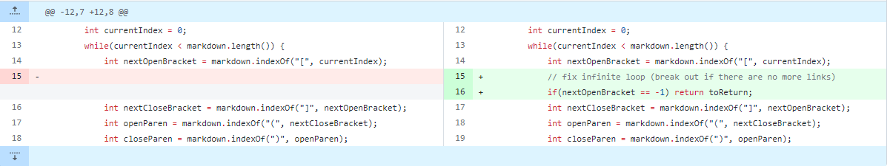
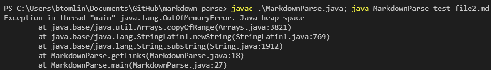
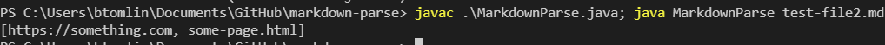
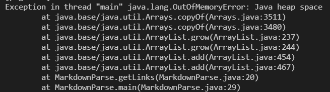
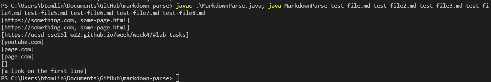
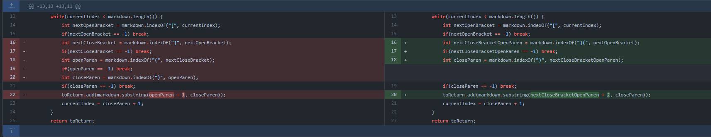
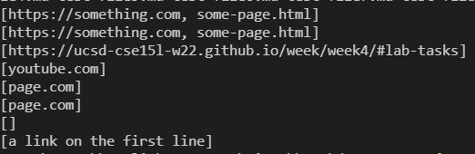
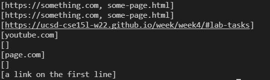

# Lab Report 2

## Code Change 1
### Code diff

### Symptom

### Output after the fix

The symptom here is an infinite loop that causes an `OutOfMemoryError`. The bug was a failure to acknowledge input with text after the links, as in [`test-file2`](https://github.com/bent101/markdown-parse/blob/main/test-file2.md). To work around the text, I tested whether or not there were any more opening brackets in the file. If not, I broke out of the `while` loop.

## Code Change 2
### Code diff

### Symptom

### Output after the fix

At first, I was getting another `OutOfMemoryError` when I tried to parse [`test-file7`](https://github.com/bent101/markdown-parse/blob/main/test-file7.md). I realized my while loop was repeating itself due to an absense of an opening parenthesis and a closing bracket in the input. The bug was a failure to acknowledge input with incomplete syntax. The symptom was an `OutOfMemoryError`. The failure-inducing input was [`test-file7`](https://github.com/bent101/markdown-parse/blob/main/test-file7.md).

## Code Change 3
### Code diff

### Symptom

### Output after the fix

I didn't get any errors or exceptions when parsing [`test-file5.md`](https://github.com/bent101/markdown-parse/blob/main/test-file5.md), but I got behavior I didn't expect. The link was working even though there was text between the closing bracket `]` and the opening parenthesis  `(`. The symptom of the bug was the output of a link when there shouldn't be. To fix this, I used `indexOf("](")` instead of `indexOf("[")` and `indexOf("(")`.
