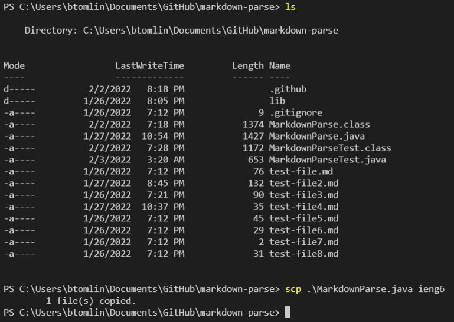

# Lab Report 3: Making an `ssh` config file

Today, I learned how to use the `ssh` config file to create an alias for the `ieng6` server.

To use an `ssh` config file, I first had to create one. I navigated to my .ssh folder and made a new file called config. I opened it in VSCode and added the following text.

After that, I tried using the `ieng6` alias to log into the server. Suprisingly, it worked first try. As shown below, I was able to simply type `ssh ieng6` to log in.

Lastly, I tried using my new shortcut to `scp` a file into my `ieng6` account. I was able to type `scp [filename] ieng6` and quickly copy over the file.

