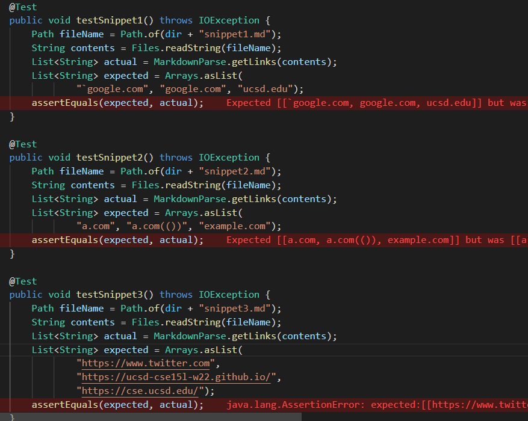
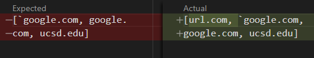
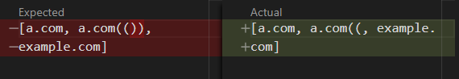
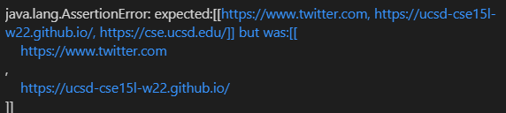
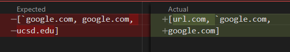
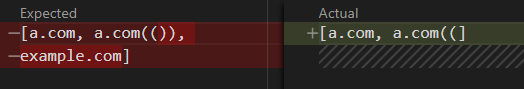
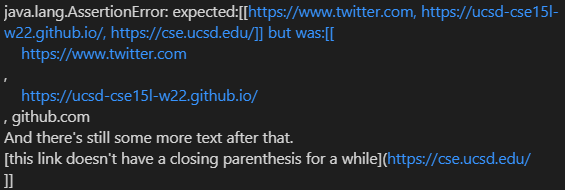

# Lab Report 6

I'll be testing [my repository](https://github.com/bent101/markdown-parse) and [Tyler's repository](https://github.com/tylercyang/markdown-parse) against three markdown snippets. To get an expected output, I'll use VSCode's markdown preview.

First, I wrote JUnit tests for each of the snippets:

## My implementation

None of the tests passed for my implementation, so I investigated the expected and actual output for each snippet. 

### Snippet 1

For snippet 1, I counted url.com as a link when I shouldn't have. 

I think there is an easy fix: I need to keep track whether or not I am in a code block, and only start making a link if I'm not in one. I can keep track of whether or not I'm in a code block by switching a boolean every time I encounter a back tick - unless I'm inside a link or image URL. However, there are probably more cases I'm not thinking of. 

### Snippet 2

For snippet 2, I ended the second link at the first closing parenthesis instead of waiting for the parentheses to become balanced.

To fix this, I would keep a count of open parentheses minus closed parentheses and only end the link if the count is 0 or if the file ends.

### Snippet 3

For snippet 3, I  didn't include the link "https://cse.ucsd.edu/" because the closing parenthesis was separated from the rest of the link by two newlines.

To fix this, I would only invalidate a link only if the link itself (instead of the link and the parentheses) contains two newlines in a row.

## Their implementation

Tyler's implementation didn't work for any of the snippets either. Interestingly, all of his outputs were different from mine. The test results are shown below.

### Snippet 1

### Snippet 2

### Snippet 3

