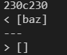
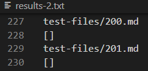
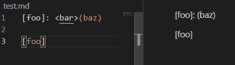
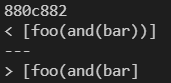
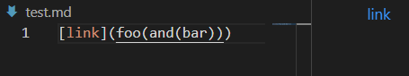

# Lab Report 5

First, I used `diff` to compare the two different `results.txt` files that correspond to my implementation and Prof. Politz's implementation. There were around a dozen differences between my `results.txt` and his `results.txt`.

## First difference

The first difference I looked at was this one.

I knew from the diff that I had to look at line 230 of either file to figure out which test the difference was coming from. By `scp`-ing both `results.txt` files, I found it was test #201.

Prof. Politz's implementation recognized a link with the address `baz`, while mine did not find any links. To find out who was right, I pasted `201.md` into VSCode and looked at the preview. VSCode did not give any links either, so either I am right or Prof. Politz's implementation is following a different set of rules. To fix it, he should only count the link as a link if there is no extra characters between the closing parenthesis and the opening bracket.

 
 ## Second difference

 The second difference I looked at was this one.

 

 This time, the test file in question was `495.md`. Joe's implementation didn't end the link until the parentheses were balanced, while mine ended the link as soon as there was a closing parenthesis. Upon pasting `495.md` into VSCode, I found that Prof. Politz's implementation was right.

To fix my code, I would need to keep a count of open parentheses minus closing parentheses, and only end the link if the count is zero. In this case, the count would have been 2 at the point where I closed the link. The count would then decrement twice (once for each remaining closing parenthesis) and the link would end at the correct spot.
